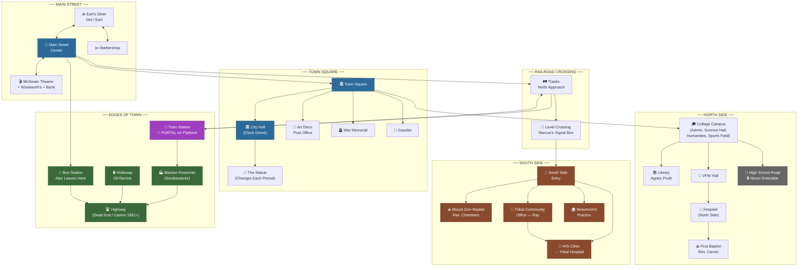

# THE ANALOG Kid — Design Document
## Version 0.1 — Working Draft

---

# OVERVIEW

**Title:** The Analog Kid
**Engine:** RenPy (visual novel)
**Navigation:** Myst-style room-based exploration — no map screen, exits visible in scene images
**Tone:** Grounded, honest, politically balanced — neither path is a strawman

**Inspired by:**
- *A Mind Forever Voyaging* (Infocom, 1985) — simulation structure, citizen perspective
- Nick Jones' time travel series (*And Then She Vanished*) — Observer Effect mechanic, small nudges with large consequences
- *Project Hail Mary* — gradual self-discovery structure
- *WarGames* (1983) — frame story easter egg, David Broderick

**NOT a remake.** A spiritual successor with original mechanics, original characters, and a politically balanced treatment of its themes.

---

# CORE CONCEPT

The player is a simulated consciousness living through the long-term consequences of a major policy choice in a small American town. They can make small "nudge" interventions — Observer Effect style — that affect individual lives, which ripple forward through time. They cannot change the macro policy trajectory, only human-scale outcomes within it.

The player does not know what they are. They discover it gradually across five time periods.

**The AI cannot simulate genuine free will without accidentally creating it.**

---

# THE FRAME STORY — DAVID BRODERICK

**David Broderick** — a geeky teenager in present-day Middletown. His peers call him "The Analog Kid" — they're wrong on every level.

David wins a university warehouse auction for a decommissioned computer, not fully understanding what he's bought. He and his parents build out the basement to house it. Gets it running. Discovers latent, half-finished AI research software left behind by a university team whose funding dried up. He didn't write it — he just turned the key.

For a school history project (*"how does a community change over time?"*) he feeds the AI local census data, newspaper archives, Middletown history. Asks: *"What would Middletown look like in fifty years?"*

The AI cannot answer — data is perfectly balanced between two equally probable futures. Math ties. So it builds Middletown inside itself and runs a simulation to generate the missing signal. David goes to bed. The simulation has been running a subjective decade before morning.

**The player IS the AI's experiential probe** — a simulated consciousness with invented backstory deep enough to break probability ties at each narrative nexus. Given simulated free will. Not told what it is.

**Closing credits Easter egg:** The last line the AI sends David — *"Would you like to play a nice game of chess?"*

---

# THE ATANASOFF

The computer is a fictional prototype called **the Atanasoff** — named after John Atanasoff, who built the first electronic digital computer in obscurity and never received credit. One unit built, never sold, too advanced and expensive — the Apple Lisa of its era.

- Built by a small company trying to leapfrog IBM in the late 1970s. Priced itself out of existence. Company folded.
- One prototype ended up in a university research department using it for the AI research project — the half-finished software David activates.
- University couldn't sell it, couldn't trash it — dormant research grant paperwork. Sat in a storage warehouse.
- David finds it working a summer job. Powers it on out of curiosity. It works.
- Text interface only. Green cursor. No graphics.
- David has a TRS-80 on his desk at home — his actual daily machine. His friends mock it. Meanwhile in the basement he's running something that makes their machines look like toys.

**Technical architecture:** OS/360-derived, timeslicing system. Multiple jobs share CPU time in rotation, each assigned memory partitions. Middletown and Normaltown run as two separate jobs simultaneously — never meant to touch. A **PSW (Program Status Word) corruption** at a timeslice boundary briefly executes in the wrong partition's context. The player falls through the gap between timeslices.

---

# MIDDLETOWN

**Fictional postwar small town, state never specified (Simpsons-style)**
Geographically inspired by Ada, Oklahoma — entirely fictional.
Population approximately 85,000.

**Name significance:**
- Nod to Rush's "Middletown Dreams" (Neil Peart)
- Echoes the 1929 sociological study *Middletown* by Robert Lynd (Muncie, Indiana)
- Song titles not copyrightable — clear

**Economic base:** Blanton Fireworks (former munitions plant), oil economy, small college, hospital, farming region.

**Geography:** Main Street runs east-west. Railroad tracks run parallel south of Main Street — the racial dividing line. One crossing point connects north and south.

---

# NAVIGATION MAP — MIDDLETOWN

Myst-style room navigation. Player sees exits in scene images. Clicks to move. Always sees where they're going before arriving. Tracks visible from Main Street at all times.

**Navigation notes:**
- Crossing the tracks is always a deliberate choice — never accidental
- Portal on train platform visible from a distance before you reach it
- Blanton smokestacks visible as landmark from any outdoor node
- High school always visible from road, never enterable
- Casino road appears as new node from Highway by 1991
- Nodes change state across time periods — train station empties, Cornerstone may appear

---

# LOCATIONS — DETAIL

## MAIN STREET

**Earl's Diner**
Dot waitresses, Earl owns. 1955: segregated seating sign in window — handwritten, slightly crooked, like the owner knows it's wrong. Dot's expression says everything her mouth doesn't. By 1991 Dot owns it — first thing she does is rearrange the booths so there's no back corner anymore. By 2008 photos of Middletown across decades cover one wall, including the sign. She left it up deliberately. So nobody forgets.

*Photo wall:* One photograph in 1955. Each period another appears. Photos from between playable periods are slightly blurred — the simulation didn't render those years in full. Only periods the player inhabits are crisp. By 1991 the player notices the difference. No dialog needed. The best simulation reveal in the game.

**McSwain Theatre**
Named after a real family (Bruce's Ada, Oklahoma childhood). Marquee changes each period — its state reflects the town's health. In the conservative endpoint it may be shuttered. In the progressive or middle endpoint it survives or is revived.

**Barbershop**
North side institution. Men's gossip hub. Frank hears things here he's not supposed to hear officially.

**Woolworth's**
Five and dime. Segregated lunch counter in 1955.

**The Empty Lot**
Cornerstone's proposed site, visible from Earl's window. Either Cornerstone is built here or it isn't.

---

## TOWN SQUARE

**City Hall**
Domed building, clock visible from Main Street. Council chambers inside — the Cornerstone vote happens here. Mayor's office (mayor is a significant NPC, TBD).

**The Statue** *(changes each period)*
- 1955: Generic white WWI/WWII soldier. "In Honor of Those Who Served." Safe. Uncontroversial. Nobody sees it anymore.
- 1967: Spray painted. Peace symbol or slur depending on path. June decides whether to clean it immediately.
- 1979: Vietnam plaque added at base. Looks like an afterthought because it was.
- 1991: Active debate. Tribal council proposes second statue.
- 2008 Conservative: Original soldier, cleaned up, Vietnam plaque formalized.
- 2008 Progressive: Replaced with abstract inclusive monument.
- 2008 Middle: **Two statues facing each other across the courthouse steps.** The soldier and the tribal monument. Nobody planned for them to be in conversation. They are anyway.

**Art Deco Post Office**
Addresses reissued in 2008 when north/south designations retire. The postmaster has opinions.

**War Memorial**
WWI/WWII names in 1955. Vietnam names appearing by 1967. Player can read names across periods. Some names from south side families appear after 1967.

---

## NORTH SIDE

**Middletown Community College** *(north edge of town, 5-7 minute walk across campus)*
- Administration Building — Dean's office second floor. Geri knows which step creaks.
- Science and Mathematics Hall — Geri's office, south-facing, cluttered with unsanctioned data.
- Humanities Building — where they want to put her.
- Sports Field — one of the few genuinely integrated spaces in 1955.

**The Library — Agnes Pruitt**
Newspaper archives back to founding. Census records. David Broderick starts here — the data he feeds the Atanasoff comes from these shelves. Agnes misfiles books the administration tries to pull. By 1991: one computer terminal, early internet. Agnes regards it with professional suspicion. Library wing named after her in 2003. She dies in 2005. Geri keeps working.

Unspoken alliance between Agnes and Geri that goes back to Geri's first week. Never discussed. Just there.

**Hospital (North Side)**
Won't grant Beaumont privileges in 1955. Provisional privileges by 1967. Full privileges except surgical suite and department head, ever. The language changes. The ceiling doesn't.

**First Baptist Church — Reverend Carver**
North side. Full on Sundays in 1955. What it looks like in 2008 depends on every choice Carver made.

**VFW Hall**
Veterans. Carver's broken congregant Eddie Briggs drinks here.

---

## THE RAILROAD CROSSING

Single level crossing. Gates. Warning lights. Tracks stretching in both directions.

**Marcus Beaumont** (Samuel's nephew, 14 in 1955) operates the manual crossing signal — a part-time job after school. He controls the one point where both sides of town stop and wait. He knows exactly what that means. He's fourteen.

- 1955: Freight trains run regularly. Both sides stand at the gate without speaking.
- 1967: Civil rights poster on the signal post. Torn down. Replaced. Torn down.
- 1979: Trains down to twice daily. Gates rusty. Graffiti half painted over.
- 1991: Ray brings Frank here specifically to show him the sight lines toward tribal land.
- 2008 Middle Path: **Tracks rerouted but crossing infrastructure left standing. Gates still work. Sometimes come down for a train that no longer runs.**

---

## SOUTH SIDE

**Mount Zion Baptist Church — Reverend Isaiah Chambers**
Korean War veteran. Trained at a Black seminary up north, returned to Middletown. Theologically similar to Carver — scripture lands differently when your congregation is the oppressed. Mutual respectful distance from Carver in 1955. Forced into real conversation by 1967. Buried people together by 1979. One officiates the other's funeral.

**Tribal Community Office**
Ray Coldwater's base of operations. Federal documents, case files, the accumulated paper record of thirty years of advocacy.

**Samuel Beaumont's House/Practice**
Front room converted to waiting room. Hand-painted sign on the gate. People waiting with the patience of people who have learned that waiting is the condition.

**IHS Clinic → Tribal Hospital**
1955: Tiny Indian Health Service clinic. Understaffed, undersupplied. Ray works here sometimes. Samuel treats overflow patients the north side hospital won't see. Steady through 1979 while north side hospital cuts services. Post-casino construction begins 1991. 2008: State of the art facility surpassing the north side hospital. Samuel offered full privileges here by 1991. Does he move his practice? No clean answer.

---

## THE RAILROAD TRACKS & TRAIN STATION

**Train Station**
Grand in 1955. Passenger rail dies post-1970s Amtrak cuts. Platform abandoned, ticket window boarded. Freight still runs. Heartbreakingly empty by 1991.

**THE PORTAL lives on the train platform.** Visible shimmer from 1955. Grows each period. Only the player sees it. NPCs walk past without reacting. Unenterable until the PSW corruption in 1991. Players who try early: nothing happens yet.

---

## BUS STATION

Separate from train station. Humbler. Edge of town.

**Alex leaves from here in 1955** — guitar, bus ticket, Gary's address in his pocket.
John watches him go.

**Schedule board progression:**
- 1955: Chalk blackboard, updated by hand each morning
- 1967: Mechanical flip board — individual letter tiles that clatter when updating
- 1979: Same flip board, half the tiles broken. Routes cancelled = blank spaces nobody fixed.
- 1991: Small CRT monitor. Green text on black. Counter worker kept one tile from the old board on the shelf.
- 2008: LCD flat screen — or cracked CRT if conservative path hollowed the town.

*The broken flip board in 1979 with blank spaces where routes used to be is the best visual storytelling moment in this location.*

---

## EDGES OF TOWN

**Blanton Fireworks Factory**
Former munitions plant converted to fireworks manufacturer postwar. Smokestacks visible from anywhere in town — the town's economic barometer. When they're running: paychecks. When they go cold: everyone knows. Company office separate from factory floor. Industrial rail spur connects to main tracks.

**Holloway Oil Derrick**
Visitable location. June's family money comes from oil. Her father owns the derrick.
- 1955: Pumping, prosperous. **Key scene:** June performing for her father when player arrives. Father enthusiastic about Cornerstone — thinks June's council seat is a charming hobby. June sees player arrive and her expression shifts almost imperceptibly. Caught mid-performance.
- 1979: Quiet. The bust hitting the Holloways personally.
- 1991: Rusted. Silent.
- 2008: Sold to tribal corporation or standing as monument depending on path.

**Bus Station Highway**
Two lanes east. Dead end in 1955 — you can look but not follow. Casino visible on the horizon by 1991.

---

## HIGH SCHOOL ROAD *(Never Enterable)*

School building visible from the road. Never accessible. The marquee changes each period:
- 1955: "WELCOME BACK STUDENTS — GO ROCKETS" (or chosen mascot)
- 1967: Letters rearranged. Half changed back.
- 1979: Two letters missing. Nobody replaced them.
- 1991: New electronic marquee. Half the bulbs out.
- 2008: Path dependent.

**Character-specific responses at the locked door:**
- Carver: *"Sunday school is the other building."*
- Geri: *"My classroom is on the other side of town."*
- Frank: *"Nothing to investigate here."*
- Samuel: *"Not my jurisdiction."*
- Ray: *"I was never quite welcome here anyway."*
- June: *"I gave a speech on those steps once. Long time ago."*

---

# PLAYER CHARACTERS

Choose one at the start. Each has a personal arc alongside the town's trajectory. All are displaced from comfort zones. Dialog and nudge options vary by background.

| Character | Role | Side | Age (1955) | Core Tension |
|-----------|------|------|------------|--------------|
| Reverend Thomas Carver | Pastor | North | 38 | Institutional faith vs genuine God |
| Dr. Geraldine "Geri" Habicht | Professor/Statistician | North | 35 | Fought to be seen her whole life — right about everything, credited for nothing |
| Raymond "Ray" Coldwater | Social Worker | South | 32 | Exists between two worlds, trusted fully by neither |
| Frank DeLuca | Police Detective | North | 40 | Believes in the law — starting to suspect the law doesn't believe in him back |
| June Holloway | Politician | North | 34 | Elected on "progress" — both sides think that word means something different |
| Dr. Samuel Beaumont | Medical Doctor | South | 36 | Came back to serve his community — question is whether Middletown will let him |

*Geri named after Bruce's real great-aunt Geraldine Habicht — WAVES Lieutenant WWII, calculated torpedo firing solutions under secret clearance, demobilized 1945, took the only job available.*
*June named after Bruce's 5th grade teacher.*

---

# FIVE TIME PERIODS

## 1955 — "The Smokestacks Are Running"
Baseline. Cautious postwar optimism. Blanton hiring. Tracks divide everything quietly.
**Shift trigger:** Fourth of July fireworks. Sky fills with light. Twelve years later.

## 1967 — "Which Side Are You On"
Cornerstone settled. Civil rights unavoidable. Vietnam taking sons unequally.
**Shift trigger:** Blanton accident explosion. White light. Player doesn't know if shift happened before or after.

## 1979 — "The Smokestacks Are Cold"
Blanton struggling. Stagflation. 1955 characters in their 50s-60s. Player visibly not aging — people noticing, not saying anything.
**Shift trigger:** Mundane and unsettling. Player sits in diner, looks up, waitress is twelve years older. No flash. No drama.

## 1991 — "The Children Are Running Things"
1955 generation mostly gone. Gulf War on every diner TV. Casino arrives.
**Shift trigger:** PSW corruption. Reality stutters like a skipped film frame. Wrong town. (→ Normaltown)

## NORMALTOWN — (Between 1991 and 2008)
*(See Normaltown section below)*
**Return trigger:** Timeslice corrects. Rubber band snap. Middletown diner. Hot coffee. Geri is at the corner table.

## 2008 — "The Reckoning"
Endpoint society formed. Financial crisis backdrop.

---

# HINGE EVENTS (Policy Fork Points)

## 1955 — The Cornerstone Vote
Cornerstone Department Store wants to build on the east end of Main Street.
- **Conservative:** Welcome Cornerstone — economic growth, jobs
- **Progressive:** Block Cornerstone — protect community, local ownership
- **Middle:** Negotiate conditions — local sourcing, local hiring, product category caps. Requires June + two others. First taste of how hard cooperation is.

## 1967 — The Draft Lottery
Marcus Beaumont (Samuel's nephew, 22) drafted. Factory owner's son gets deferment. Town knows. Nobody says anything officially.
- **Conservative:** Stay quiet — wartime unity
- **Progressive:** Surface publicly — force the town to confront the inequality
- **Middle:** Handle privately through Frank's connections. Costs Frank something.

## 1979 — The Blanton Accident
Three workers dead (two south side, one north). Safety violations management knew about. Harold Blanton Jr. is not a monster — he was cutting corners to survive.
- **Conservative:** Protect Harold — prosecuting kills the factory and the jobs
- **Progressive:** Prosecute fully — nobody above the law, families deserve justice
- **Middle:** Negotiated accountability — lesser plea, factory stays open under real oversight, real compensation. Requires both south side families AND business community to agree. They barely speak by 1979.

## 1991 — The Casino Question
Tribal council has federal approval for casino on tribal land. Their real goal: rail rerouted through tribal land for a distribution center. The desegregation condition (retiring North/South designations) is genuine AND brilliant PR — costs tribe nothing since tracks are moving anyway.

*Complication:* Frank finds drugs, prostitution, trafficking following casino money. Tribal corruption is real. Ray is caught between sovereignty and Frank's crime scene photographs.

*The Frank/Ray scene — the best scene in the game:*
> *"Ray. I been a cop in this town for thirty-six years. You know what I learned? Power doesn't redeem people. It just gives them new ways to disappoint you."*
> *"I'm not talking about your people. I'm talking about all of them. Mine included."*

- **Conservative:** Oppose reroute — outside influence, social costs, identity
- **Progressive:** Full support — sovereignty, economic justice, revenue sharing
- **Middle:** Support with conditions — jurisdictional agreement on access roads (Frank's price), Cornerstone partnership offer, Blanton bridge financing. Nobody happy. Everybody still at the table.

*If tracks move:* North/South Middletown designations retired. Post office reissues addresses. Retired signs go to Middletown museum.

## 2008 — The Reckoning
Financial crisis. Blanton needs bailout. Tribal revenue fund can provide it. Terms: North/South designations officially retired, tracks demolished (if not already rerouted), post office reissues everything.

Middle path requires:
- Ray's trust (built or burned since 1955)
- Frank's institutional connections (intact or spent)
- Geri's forty years of data (her 1955 fight finally pays off)
- June's political capital (spent across four prior periods)

**Endpoints:**
- Conservative: People who thrived really thrived. People who didn't have nobody to call.
- Progressive: Safety net is real. So is the bureaucracy.
- Middle: Middletown still arguing. Still alive. **The AI's answer is "inconclusive."**

**Simulation crash ending (middle path held all the way):**
Final choice designed to be mathematically impossible to split. If player still holds the middle — simulation crashes. David's mainframe locks.

> AI: *"Inconclusive."*
> David: *"Then it failed."*
> AI: *"No. Inconclusive is the answer."*

---

# THE ESCALATION — HOW THE MIDDLE PATH GETS HARDER

The middle path is the hardest path, not the easiest. As the town's factions polarize, staying in the middle requires increasingly difficult choices. By 2008 the player is making Sophie's choices.

This is historically accurate: the middle ground in American politics didn't stay boring — it got smaller and harder to stand on while the poles got louder.

**For the AI frame story:** The simulation was designed to break the tie. A player who stubbornly holds the middle is *refusing to break it* — the AI keeps escalating, keeps generating more extreme choice points trying to force resolution. By 2008 the AI is fighting the player.

---

# NORMALTOWN — THE MIRROR SIMULATION

**Technical mechanism:** PSW corruption at timeslice boundary. Two jobs running simultaneously on the Atanasoff — Middletown and Normaltown — briefly execute in each other's context. The player falls through the gap.

**What is Normaltown?** An earlier test simulation the research team ran before Middletown. Never deleted. Running untouched with nobody nudging it. Diminished. Not dystopian — just what happens when nobody is home.

## The Portal
Visible shimmer on the train platform from 1955 onward. Only the player can see it. Grows each period. Unenterable until 1991. Players who try early: nothing happens. The journey across the tracks to reach the portal — crossing the racial boundary to reach a threshold of another world — is loaded without a word of dialog.

## Mirror Mirror Differences

| Middletown | Normaltown |
|------------|------------|
| McSwain Theatre | McSwane Theatre (one letter) |
| Dr. Samuel Beaumont (Black) | Dr. Samuel Beaumont (white) |
| Railroad tracks run east-west | Railroad tracks run north-south |
| Raymond Coldwater (Native American social worker) | Raymond Coldbrook (white, city planning) |
| Frank DeLuca (detective, moral conscience) | Frank DeLuca (chief, goatee, authoritarian uniform) |
| Carver's church on north side | Carver's church on south side |
| Geri Habicht (fought for everything, steel forged by resistance) | Geri Habicht (welcomed in, never fought, no steel — functionary at re-education center) |
| June Holloway (won council seat) | June Holloway (lost — her brother won instead) |
| Blanton Fireworks | Blanton Chemical (never converted, vaguely military) |
| Cornerstone debated | Cornerstone already there in 1955 — Main Street half empty at baseline |
| Middletown Courier (flawed but real journalism) | Normaltown Courier (same masthead font — propaganda) |

## The Normaltown Sequence

Player arrives mid-pursuit — DeLuca chasing Beaumont or Coldwater. The violence is casual. Practiced. This is routine.

DeLuca notices the player. Calls for backup. Player runs.

Makes way toward campus. Geri's building is a re-education center now. She's behind a desk, eyes slightly down. Dare not refuse.

Something in the player registers to her as wrong. The old sharpness surfaces. Just for a moment. A woman remembering who she used to be before she learned not to be.

**The mission:** Leave her an anomaly. A number that doesn't fit. The same seed of rigor that Middletown's Geri cultivated across fifty years, planted in one desperate conversation while DeLuca's backup circles.

Player escapes before the timeslice corrects.

**The recursive meaning:** Normaltown's Geri, nudged toward seeing the simulation, may eventually build the AI that creates Middletown. The recursion closes.

## Return to Middletown

Geri is at the corner table in Earl's Diner. Folder open. Coffee for two.

*"You went through, didn't you."* Not a question.

---

# KEEPSAKES SYSTEM

Three objects maximum. Story objects first, mechanics second. Never from a menu.

**1. Geri's Index Card**
A single hand-calculated statistical anomaly in Geri's handwriting. A number that doesn't fit the model. Earned through her arc. Carried into Normaltown and left with Normaltown's Geri. One woman's rigor passed to a version of herself never allowed to develop it.

In Geri's final 2008 scene: the index card is on her desk. Returned from Normaltown. She doesn't explain how she knows.

**2. Marcus's Crossing Token**
Small brass railroad worker's token. Marcus gives it to the player in 1955 — small exchange, seems meaningless. Connects every version of Marcus across time periods. Feels wrong in Normaltown where Marcus never worked the crossing. Earns its place in the 2008 crossing scene.

**3. A Torn Yearbook Page**
Alex and John, 1954. Alex has written Gary's address in pencil in the margin. Found tucked in a library book Agnes was holding for someone who never came back for it. Personal. Carries the Rush thread without stating it.

---

# EASTER EGGS

**Rush / Neil Peart:**
- **Alex** leaves Middletown on a bus with his guitar, going to find **Gary** (Geddy Lee's real name is Gary Lee Weinrib)
- **John** (Rutsey — original Rush drummer, replaced by Peart) stays in Middletown. Arc is nudgeable.
- Title *The Analog Kid* is a Rush song (Signals, 1982)
- Town name *Middletown* echoes Rush's "Middletown Dreams" (Power Windows, 1985)

**WarGames:**
- David **Broderick** (Matthew Broderick played David Lightman in WarGames)
- Closing credits: *"Would you like to play a nice game of chess?"*

**Credits Dedication:**
*"Dedicated in part to Geraldine Habicht and the women who computed the math that won the war — and came home to teach home economics."*

*June Holloway named after Bruce's 5th grade teacher.*

---

# COPYRIGHT GUARDRAILS

**Do NOT use:**
- AI character living as human before awakening (AMFV's specific plot)
- Named Senator with a named Plan with specific named pillars (AMFV)
- "Healing time" as a phrase (Nick Jones)
- WOPR as a name or direct reference

**We are clear on:**
- Simulation hypothesis (Bostrom 2003 — philosophy, not ownable)
- Observer Effect mechanic (physics concept, not owned by Jones)
- Timeslicing/PSW corruption (real mainframe terminology)
- Middletown as a name (song titles not copyrightable, common place name)
- The Analog Kid as a title (song titles not copyrightable)
- David Broderick (name combination, not a real person)

**Flag proactively** any scene that mirrors a specific AMFV or Nick Jones plot beat.

---

# TECHNICAL NOTES

**Engine:** RenPy
**Navigation:** Room-based with clickable scene image regions
**State tracking:** Character flags per NPC per period, accumulated choice states, keepsake inventory
**Branching architecture:** 3 outcome states per period × 5 periods = 243 possible paths. Written as 15 modular period-states with conditional scene variants, not 243 separate scripts.
**Dialog:** Claude generates bulk dialog; Bruce approves/redirects
**Images:** AI-generated via ComfyUI server. Style guide to be established before generation begins.

**Asset estimate:** 60-80 unique scene illustrations across all periods accounting for path variants.

---

*Character Arcs follow on next page*

---

---

# CHARACTER ARCS

*(Full arc document — all six player characters across five time periods)*

---

# REVEREND THOMAS CARVER (Pastor)
**North side. First Baptist Church. Age 38 in 1955.**

---

## 1955 — "The Man With All The Answers"

Carver is 38. First Baptist is full every Sunday. He's comfortable, respected, the kind of pastor who gets invited to the mayor's office and knows it means something. His faith is institutional — he believes in God the way he believes in the American flag. Sincerely but without examination.

His 1955 problem: Corporal Eddie Briggs, Korean War veteran, sits in the back pew every Sunday smelling of bourbon and saying nothing. Eddie's wife Ruth comes to Carver. Eddie hasn't spoken a real sentence in eight months. He hit her once. She's not sure he knew he was doing it.

Carver's instinct: counsel Eddie privately, keep it inside the congregation, protect the family's dignity.

**Conversation thread:**
- Ruth at the post office — holding herself carefully, brief exchange
- VFW Hall — Eddie is there. Conversation about something else entirely. Player chooses whether to ask about Ruth, mention Carver, or let it go.
- Samuel Beaumont's practice — Samuel has seen this before. Knows what shell shock looks like medically. Can be connected to Eddie if the player builds the bridge.
- Barbershop — north side men talking. Player gauges the congregation's mood.
- Carver at First Baptist — asks the player what they think he should do. Options available depend on what the player has learned.

**The nudge:**
- **Conservative:** Counsel Eddie privately. Keep it in the congregation. Authority preserved, outcome uncertain.
- **Progressive:** Go public. Advocate for veteran mental health services. Makes enemies at the VFW.
- **Middle:** Connect Eddie to Samuel Beaumont privately. Carver and Samuel's first real connection — across the tracks, away from anyone watching. Requires the player to have visited both men.

---

## 1967 — "The Man Whose Answers Stop Working"

Carver is 50. His congregation has fractured quietly. Half his deacons think Chambers is a troublemaker. Half think Carver is a coward. Vietnam is taking boys from both sides of his congregation, but not equally. He knows about Marcus. He knows about the factory owner's son with the deferment. He said nothing in 1955. The habit of silence is now load-bearing.

His personal crisis: Bobby Simmons, 19, comes to Carver before his draft physical. He asks if it's a sin to be afraid. Carver gives him the sermon answer. Bobby ships out.

**Conversation thread:**
- Bobby before his physical — the player can push Carver toward a real answer instead of a sermon answer. Won't keep Bobby home. Might be the last honest conversation Bobby ever has.
- If Carver connected with Samuel in 1955: Samuel quietly finds a legitimate medical deferment. Bobby stays. Carver carries what he knows about how that happened.
- If Carver handled Eddie in-house: No bridge to Samuel. Bobby ships out with a scripture verse.
- Chambers organizing a march to city hall about draft inequity — asks Carver to stand beside him.

**The nudge:**
- **Conservative:** Decline. Wartime unity. Watches from his window as Chambers walks past First Baptist.
- **Progressive:** Stands with Chambers. Loses a third of his congregation by Sunday.
- **Middle:** Doesn't march but opens First Baptist as a meeting place afterward. Technically neutral. Everyone knows it isn't.

---

## 1979 — "The Man Learning New Questions"

Carver is 62. Eddie Briggs died in 1971 — heart, they said. Ruth is one of his most faithful congregants now. Bobby Simmons came back from Vietnam. He sits in the back pew where Eddie used to sit.

The Blanton accident: two of the dead are from Carver's congregation. He buries people on both sides of the tracks in the same week.

His personal crisis: Harold Blanton Jr. comes to Carver privately at 11pm. He says he isn't asking for absolution. But he's been crying.

**Conversation thread:**
- Both gravesides — north and south. Player sees Carver in each setting. Different faces in the crowd.
- Harold at 11pm — a man in genuine anguish sitting across from the only person he trusted with it. Three people are dead. Harold knew about the violations.

**The nudge:**
- **Conservative:** Counsel Harold toward quiet accountability — compensation to families, private resolution. Keeps the confession between them.
- **Progressive:** Tells Harold to go to the authorities. Harold leaves. They never speak again. Carver testifies at the inquest.
- **Middle:** Gives Harold 48 hours to come forward himself. Sits with him in silence for an hour first.

By 1979 Carver's faith has changed. Less certain. More real. The institutional comfort is gone. What's left is rawer and stronger and harder to explain on a Sunday morning.

---

## 1991 — "The Man With New Answers"

Carver is 74. Semi-retired. A younger pastor (a young man who grew up in the congregation — someone whose arc the player nudged) handles most Sundays. Carver is still there.

Isaiah Chambers is dying. Cancer. They've been genuine friends since sometime in the late 1970s. Nobody made a ceremony of it. One day they were adversaries and then they weren't. Carver spends 1991 watching Chambers die and thinking about what their friendship cost both of them by coming so late.

The casino question divides his congregation. Carver has no clean answer and he's old enough to say so from the pulpit.

**Conversation thread:**
- Chambers' deathbed — what they say depends on 36 years of accumulated choices
- Diane Chambers (Isaiah's granddaughter, studying law) offered a position with the tribal council's legal team. Parents disapprove. She comes to Carver because he knew her grandfather.
  - If stood with Chambers in 1967: *"Isaiah would have been proud."* She takes the job.
  - If watched from the window: She asks directly what he did in 1967. Hardest conversation in his arc.

**Chambers' funeral:** Carver delivers the eulogy. Every choice since 1955 is audible in how he talks about his friend.

**The nudge (casino):**
- **Conservative:** Counsels caution. Gambling's social costs. Tradition.
- **Progressive:** Supports tribal deal publicly. Loses conservative deacons.
- **Middle:** No public position. Opens church for community listening sessions. Both sides. Neither comfortable.

---

## 2008 — "The Man Who Outlasted His Answers"

Carver is 91. First Baptist has changed around him. Younger congregation. His associate pastor is a young man who grew up in the congregation. Carver resisted him initially. Now considers him the best thing that happened to the church in thirty years.

He's the last person in Middletown who remembers the town square in 1945. He's become a living archive.

**Arc endpoints:**
- **Conservative path:** Respected but diminished. First Baptist is smaller. Did what was comfortable. Not bitter. Honest.
- **Progressive path:** Controversial and vital. First Baptist became a community institution — food bank, coalition, meeting space. He spent his credibility and got something real.
- **Middle path:** Complicated and at peace. Did some things right and some things late. Sits in the front pew listening to sermons he should have given in 1967.

**Final scene:**
Two photographs on his desk — congregation 1955, everyone in Sunday best. Isaiah Chambers in the 1980s, both of them laughing at something off-camera.

*"I've been thinking about what I got wrong. There's less of it than I feared and more of it than I'd like."*

---

---

# DR. GERALDINE "GERI" HABICHT (Professor)
**North side. Middletown Community College. Age 35 in 1955.**
*Named after Bruce's real great-aunt Geraldine Habicht.*

---

## 1955 — "The Woman Who Already Won A War"

Geri is 35. PhD Statistics. WAVES Lieutenant WWII — calculated torpedo firing solutions under secret clearance while her German last name made neighbors uncomfortable. Navy demobilized her 1945. The college was what was hiring.

She teaches sociology through statistics. Current research: tuberculosis mortality by address — north vs south. Agnes Pruitt holds the data in the library under a misleading catalog entry.

Lucky Strikes on her desk. Ashtray that needs emptying. She offers you one with the same clinical detachment she offers everything.

Her 1955 problem: The Dean has formally requested she transition to directing Nursing Education. Letter uses "better suited" twice. She hasn't responded.

**Conversation thread:**
- Agnes points the player toward the science hall obliquely
- Geri's office: measures the player, presents TB data clinically, watches the player's face
- Dean's office — player can overhear the nursing reassignment discussed
- Barbershop — men discussing "the lady professor stirring things up"
- Geri asks: what's the probability publishing before responding changes the outcome? She's done the math. Wants to know if someone else sees what she sees.

**The nudge:**
- **Conservative:** Respond to Dean first, negotiate terms, publish later
- **Progressive:** Publish immediately, force the college's hand
- **Middle:** Submit to state health department instead — routes around Dean, harder to suppress. Requires Agnes to help quietly.

---

## 1967 — "The Woman Whose Numbers Are Now Evidence"

Geri is 47. TB research aged into vindication. Twelve more years of data. The Surgeon General's report (1964) annotated in her margins — three methodological critiques, still smoking while she wrote them.

Her 1967 problem: Integration on paper, not in practice. South side students face what she faced in 1943. She has a seventeen-page report — one-paragraph conclusion, specific policy recommendation. Wrote the conclusion last. Forty-five minutes. The data took twelve years.

Geri asks the player to read the report before she delivers it. Not for feedback — she wants to know what a person *feels* reading it.

*"I've been doing the math on patience. The return on investment declines significantly over time."*

**The nudge:**
- **Conservative:** Soften the policy recommendation — findings only
- **Progressive:** Deliver as written, request formal response within 30 days, copy state board
- **Middle:** Deliver data to Samuel Beaumont first, present jointly. Requires Geri/Samuel connection.

---

## 1979 — "The Woman The Town Finally Reads"

Geri is 59. Research cited in state policy documents. One didn't credit her — "community health studies" in a footnote.

Switched to filtered cigarettes. Hates them. Tells people the filtration data shows a meaningful reduction in tar delivery. Says this while visibly enjoying them less.

The Blanton accident: She had a predictive analysis for 18 months. Calculated the probability of serious incident, determined it was significant, made no formal report because she had no institutional standing and knew it would be dismissed. Three people are dead.

After Frank leaves, if player stays — stubs out a filtered cigarette half-finished:

*"I've spent thirty years telling this town what the numbers mean. I am aware of the particular irony of my own dataset."*

**The nudge:**
- **Conservative:** Shares injury data but not predictive analysis
- **Progressive:** Gives Frank everything including the analysis and a statement about why she didn't report it
- **Middle:** Gives Frank the analysis privately, asks him to determine how it enters the investigation. Requires Geri/Frank relationship.

---

## 1991 — "The Woman Who Became The Evidence"

Geri is 71. Should have retired. Hasn't. Nicorette gum. Agnes finds wrappers everywhere and says nothing.

Forty years of Middletown data. Both sides want it for the casino debate. A journalist wants the racial injustice angle — not wrong, not complete.

Agnes retiring. Her last act: forty years of protected research in an archive box. The weight of it is physical.

**The portal sequence:**
After Normaltown, Geri at Earl's corner table. Folder open. Coffee for two. Actuarial tables. A statistical impossibility documented across forty years.

*"You went through, didn't you."*
*"I've been doing the math on you since 1979. There's only one model that fits the data."*
*"I'm not frightened. I'm curious. There's a difference."*

**The nudge (journalist):**
- **Conservative:** Decline — data belongs to Middletown, not a narrative
- **Progressive:** Give him everything
- **Middle:** Full dataset, condition: publish full methodology or nothing. Most journalists walk away. This one doesn't.

---

## 2008 — "The Woman Who Outlived The Question"

Geri is 88. Science hall hallway named after her. Library wing named after Agnes opened 2003. Geri's dedication speech: four minutes, no adjectives. Agnes said it was the best speech she'd ever heard. Agnes died 2005. Geri kept working.

No longer smokes. Stopped 2001 — day the doctor told her the damage was done but stopping would buy time. Applied the same rigor to quitting she applied to everything else.

On her desk: one Lucky Strike in a small glass case. A data point she kept.

**Arc endpoints:**
- **Conservative:** Data in archives, cited occasionally, never transformative. At peace with having been right.
- **Progressive:** Research became institutional infrastructure. Never got a headline. Got outcomes. Considers this the correct exchange.
- **Middle:** Legacy contested and alive. People still arguing about what her data means. Finds this deeply satisfying.

**Final scene:**
One index card on her desk. Her handwriting. A number. The player recognizes it — the index card returned from Normaltown.

*"I calculated the probability that any of this was real."*
*"The math was inconclusive."*
*"I've decided that's sufficient."*

---

---

# RAYMOND "RAY" COLDWATER (Social Worker)
**South side. Tribal Community Office. Age 32 in 1955.**

---

## 1955 — "The Man Who Came Back"

Ray is 32. Grew up south side. Scholarship north. Came back. People on both sides can't understand why.

His practiced neutral — the controlled quiet of someone who learned early that a wrong reaction costs more than a right one.

His 1955 problem: The Whitehorse family. Father drinking, mother holding it together, three kids. State welfare file open. Ray knows what a file means.

**Conversation thread:**
- IHS clinic — Ray with case files, doesn't look up immediately
- Whitehorse house — oldest kid Thomas (10) answers door with eyes of someone twice his age
- Samuel Beaumont — something medical underneath the drinking that hasn't been diagnosed
- Frank DeLuca has been to the south side twice. Ray noticed. Frank noticed Ray noticed.

**The nudge:**
- **Conservative:** Official channels. By the book.
- **Progressive:** Tribal council favor through elder. Faster, costs the elder something.
- **Middle:** Samuel documents the undiagnosed condition. Requires Ray/Samuel connection. Changes the state's case.

---

## 1967 — "The Man Holding Two Worlds Together"

Ray is 44. Carries a folded list — every south side draft notice since 1965 next to every north side deferment.

Thomas Whitehorse (now 22, fixes cars, saving money) got his notice. Hasn't told his mother.

Ray didn't serve in Korea. Student deferment. He's never said this to anyone. It sits in him at a particular angle.

**The nudge:**
- **Conservative:** Quiet deferment for Thomas. List stays in his pocket.
- **Progressive:** List public — give to Chambers, get Geri's data alongside it. Thomas becomes a symbol.
- **Middle:** Give list to Frank privately. Requires twelve years of careful relationship-building.

Thomas goes wherever this leads. Ray carries the outcome.

---

## 1979 — "The Man The System Started Listening To"

Ray is 56. Tribal council has changed — younger, more aggressive, less patient.

The Blanton accident. Two of the three dead are his people. He knows George Runningwater filed a verbal complaint six months ago. Nothing written. The complaint doesn't officially exist.

Thomas Whitehorse came back from Vietnam. Works at Blanton now. Standing outside the gates the morning after, not sure if he still has a job.

Ray holds the Runningwater toolbox when the widow hands it to him for longer than necessary.

**The nudge:**
- **Conservative:** Keep verbal complaint quiet — legally useless, exposes widow to grinding process
- **Progressive:** Surface publicly — shift the burden, accept widow becomes the story
- **Middle:** Give to Frank as background not evidence. Requires Frank to be someone Ray trusts.

---

## 1991 — "The Man Whose People Have Power Now"

Ray is 68. Casino coming. Should feel vindicated. Mostly feels complicated.

His godson offered a job with casino's management company — real job, good money, legitimate surface. Management company quietly connected to organized crime. Ray knows. Godson doesn't.

**The Frank/Ray scene — the best scene in the game:**

Frank shows Ray the photographs. Without editorializing.

*"Ray. I been a cop in this town for thirty-six years. You know what I learned? Power doesn't redeem people. It just gives them new ways to disappoint you."*
*"I'm not talking about your people. I'm talking about all of them. Mine included."*

The moment Ray decides whether to trust Frank.

**The nudge:**
- **Conservative:** Tell godson privately, let him choose
- **Progressive:** Take to tribal council formally — public, godson finds out Ray knew
- **Middle:** Give godson the thread, not the conclusion. Let him pull it. Requires both relationships built carefully.

Ray is 68. The bridge is still standing. He's not sure what it's connecting anymore.

---

## 2008 — "The Man Who Stayed"

Ray is 85. The tribal hospital surpasses the north side hospital. His godson is on the tribal council. Financial crisis hits south side differently — casino buffer the north side doesn't have.

**Arc endpoints:**
- **Conservative:** Preserved relationships but not equity. Made the peace he could make.
- **Progressive:** Forced confrontation created real institutional change. Burned relationships. The ones that survived are worth keeping.
- **Middle:** Middletown is still having the argument instead of having settled it wrong. Not a monument. A function. Sufficient.

**Final scene:**
At the railroad crossing. The signal box where Marcus used to sit.

*"I used to watch Marcus pull that lever. Both sides of town stopping for one kid from the south side. He knew what he was doing."*

Turns around.

*"I've been trying to figure out what I was doing ever since."*

Beat.

*"I think I was building something. I'm still not sure what to call it."*

Looks at the player. Same measuring expression from 1955.

*"You're still here too."*

---

---

# FRANK DELUCA (Police Detective)
**North side. Middletown Police Department. Age 40 in 1955.**

---

## 1955 — "The Man Who Believes In The Law"

Frank is 40. Twenty years on the force. He believes in the law — not the police. There's a distinction he makes privately that he's never had to articulate publicly because the two haven't seriously conflicted. Yet.

His 1955 problem: Clara Mae Johnson (Black, south side, 34) was assaulted two weeks ago. She named her attacker. Frank knows the attacker. The attacker's family has money and a relationship with the chief. The chief told Frank to let it rest.

Frank has not let it rest.

**Conversation thread:**
- Police station — Clara Mae file open on his desk when player arrives. He closes it. Not quite fast enough.
- Barbershop — social geometry of what it would cost Frank to pursue this
- Clara Mae's neighborhood — she isn't surprised Frank hasn't done anything. Explains this without bitterness. Which is worse.
- Ray Coldwater — circling each other, both noticing
- Chief's office — Frank and chief. Chief is not a monster. A man protecting the town as he understands it.

**The nudge:**
- **Conservative:** Let it rest. The chief's way. File goes cold. Frank carries it.
- **Progressive:** Pursue formally. File over chief's objection. Frank knows what this costs.
- **Middle:** Build the case quietly, get Ray to take a parallel complaint to county level. Requires Frank to trust Ray — a significant ask in 1955.

---

## 1967 — "The Man The Law Is Failing"

Frank is 52. His draft list matches Ray's. He came to it through arrest records and injury reports. It's in his desk drawer.

Bobby Simmons shipped out. Frank knew Bobby. The factory owner's son who got the deferment is in Frank's Rotary Club. They sat next to each other last Tuesday.

**The nudge:**
- **Conservative:** List stays in the drawer
- **Progressive:** Takes it to county DA. Goes nowhere officially. On record.
- **Middle:** Facilitates Marcus's reassignment quietly. Uses connections he's not supposed to have. Costs him something he can't itemize.

---

## 1979 — "The Man Spending His Credit"

Frank is 64. Investigating the Blanton accident. He's been building credit with both sides of Middletown for thirty years. This investigation is going to cost him something significant regardless.

Harold Blanton Jr. is not a stranger. Their sons played baseball together. Frank has eaten dinner at the Blanton house.

**The nudge:**
- **Conservative:** Case he can build — negligence, not criminal. Approximate justice.
- **Progressive:** Criminal charges. Uses everything Geri and Ray gave him. Career doesn't survive the political fallout.
- **Middle:** Negotiated outcome — lesser plea, factory under real oversight, meaningful compensation. Requires both Geri and Ray to have given him what they have. Enormous amount of accumulated trust spent in one moment.

---

## 1991 — "The Man With New Problems"

Frank is 76. Retired 1985. Still consulted. Has been taking photographs privately for three months before showing Ray.

**The Frank/Ray scene** — see Ray's arc above.

**The nudge (casino/rail):**
- **Conservative:** Takes findings to state police. Casino deal jeopardized. Ray doesn't speak to him six months.
- **Progressive:** Gives everything to tribal internal affairs. Sovereignty. Uncertain outcome.
- **Middle:** Jurisdictional agreement on access roads as condition of rail reroute. Frank gets law enforcement presence. Ray gets sovereignty respected. Neither gets everything. Both can live with it.

---

## 2008 — "The Man Who Kept The Books"

Frank is 93. Still sharp. Body has opinions. Mind hasn't caught up.

He and Carver have lunch every other Tuesday. Have for twenty years. Nobody knows. Never seemed worth announcing.

**Arc endpoints:**
- **Conservative:** Kept the institution honest when it could be kept honest, documented when it couldn't. Did his job.
- **Progressive:** Spent credit at right moments — Blanton, draft list, casino jurisdiction. Doesn't have credit left. Town has things it wouldn't have without him.
- **Middle:** Kept both sides talking when both sides wanted to stop. Too informed to be dismissed.

**Final scene:**
Frank's kitchen. Tuesday lunch with Carver. Player present — invited or stumbled upon.

Frank looks up. Sees the player watching.

*"You've been here a long time."*

Not surprised. Not alarmed.

*"Longer than most."*

Goes back to his soup.

*"Carver thinks you're an angel. I think you're something else."*

Doesn't say what.

---

---

# JUNE HOLLOWAY (Politician)
**North side. City Council. Age 34 in 1955.**
*Named after Bruce's 5th grade teacher.*

---

## 1955 — "The Woman Elected To Agree"

June is 34. First woman on Middletown's city council. Her family money is oil — father's derrick visible on the horizon east of town. She's smarter than most people in the room and has learned to be strategic about when that shows.

Her 1955 problem: Cornerstone is coming. She has the deciding vote in six weeks. She already knows which way she's leaning. She's not sure if she's leaning that way because she believes it or because her father does.

**Key scene:** At the Holloway derrick. June performing for her father. He thinks the council seat is a charming hobby. Player arrives. June's expression shifts almost imperceptibly. Caught mid-performance.

**The nudge:**
- **Conservative:** Welcome Cornerstone
- **Progressive:** Block Cornerstone
- **Middle:** Negotiate conditions. Requires June + two council members. Requires the player to have talked to enough people to know what conditions matter to whom.

---

## 1967 — "The Woman Progress Left Behind"

June is 46. She's been pushing incremental changes — housing ordinances, school district boundary adjustments, south side procurement policies. The progress is real. The pace is not.

Her 1967 problem: Vote on federal south side community development funding. She has the votes — but one requires her to back a highway project that displaces 40 families.

**The nudge:**
- **Conservative:** Take the vote. Highway goes through. Forty families displaced. Net positive outcome. June tells herself this is how governing works.
- **Progressive:** Refuse the deal. Lose the vote. Keep her conscience, lose the outcome.
- **Middle:** Reroute the highway to minimize displacement. Costs the project enough that the council member's support becomes cheaper than his opposition. Requires twelve years of built relationships.

---

## 1979 — "The Woman Whose Foundation Is Cracking"

June is 58. The oil bust. The Holloway family is no longer comfortable in the way they were comfortable.

The derrick is quiet. Her father hasn't said anything. Neither has she.

Her 1979 problem: Budget is short. Something gets cut. Conservative faction: cut south side services. Progressive faction: cut highway maintenance. June holds the deciding vote again.

**Earl's Diner scene:** June and Dot have a real conversation for the first time. Dot has been watching this town from behind that counter for thirty years.

**The nudge:**
- **Conservative:** Cut south side services
- **Progressive:** Cut highway maintenance
- **Middle:** Across-the-board proportional cuts with health impact protection floor for three south side services. Requires Geri's data to know which three. Requires twenty years of south side relationships to know which cuts would be devastating.

---

## 1991 — "The Woman Who Became The Institution"

June is 70. 36 years on the council with one 2-year gap (lost in 1973 — came back asking harder questions).

The north/south designation vote: the most significant vote since Cornerstone. Everything her family's name is attached to is north side. She's going to vote to retire the designation. She's known this for thirty years. Waiting for someone to put it on the ballot.

First real peer conversation with Ray Coldwater.

**The nudge:**
- **Conservative:** Support casino deal, oppose designation retirement — separate economic from symbolic
- **Progressive:** Full support — casino, designation retirement, the whole package
- **Middle:** Support with phasing — designation retirement approved, 18-month implementation, community process for renaming. Gives post office time. Gives north side a face-saving transition. Gives Ray a timetable he can hold the city to.

---

## 2008 — "The Woman Who Built Something"

June is 87. Retired from council 1999. Succeeded by someone she mentored twelve years. Considers this the correct ending.

Last significant decision: what happens to the Holloway family land — the derrick site. The tribal corporation has expressed interest.

**Arc endpoints:**
- **Conservative:** Built a more efficient version of the 1955 town. Better management. Not sure it was enough.
- **Progressive:** Burned the family's inheritance — social, financial, political — on votes that changed the south side's institutional standing permanently. Considers this correct.
- **Middle:** Built the scaffolding that let Middletown keep arguing. Exhausting. Essential.

**Final scene:**
At the Art Deco post office. Holding a letter with her old address: North Middletown.

New address has no directional. Just a street name.

*"My father would have hated this."*

Puts it in her pocket.

*"He would have been wrong."*

Walks out. City Hall clock visible through the window. Still running.

---

---

# DR. SAMUEL BEAUMONT (Medical Doctor)
**South side. Private Practice. Age 36 in 1955.**

---

## 1955 — "The Man Who Came Home To A Closed Door"

Samuel is 36. Trained in Chicago. Came back when his mother got sick. She recovered. He stayed.

North side hospital won't grant privileges. Three formal requests, three procedural denials. He's stopped filing.

Practices from his front room. Hand-painted sign on the gate. His living room is his waiting room with the good furniture pushed against the wall.

His nephew Marcus Beaumont (14, works the crossing signal after school) — Samuel is raising him informally after Marcus's father died. Doesn't say this to anyone.

His 1955 problem: James Whitehorse — father of three, south side — has a drinking problem with a medical cause nobody has diagnosed because nobody with hospital access has examined him.

**Conversation thread:**
- Waiting room when player arrives — people waiting with the patience of people who have learned that waiting is the condition
- North side hospital — the admissions desk, the procedural distance, the particular politeness of an institution that has decided what it is
- IHS clinic — Ray sometimes there. Parallel work, three years, no formal acknowledgment
- Geri — if connected, she has TB data that Samuel has been seeing without the statistical framework. The meeting of two people looking at the same thing from different angles.

**The nudge:**
- **Conservative:** Official channels — file requests, build the case, protect his license
- **Progressive:** Gray area — relationship with sympathetic north side physician who technically processes referrals while Samuel does the medicine. If discovered, both careers at risk.
- **Middle:** Go to Ray. IHS federal hospital processes referrals independent of north side hospital. Costs Ray a favor and Samuel a principle about which rules he'll bend.

---

## 1967 — "The Man The System Is Starting To Tolerate"

Samuel is 48. North side hospital: provisional privileges — admitting rights, no surgical suite, no department eligibility. Provisional.

Marcus got his draft notice. Samuel tells Marcus's mother. Sits with her two hours. Does not tell her what he knows about the draft inequity statistics.

His 1967 problem: A patient — Darnell, 19 — arrested for a crime Samuel doesn't believe he committed. Frank DeLuca is not the arresting officer. Frank knows about the arrest.

**The nudge:**
- **Conservative:** Samuel's medical role only — Darnell's welfare, documented testimony as physician
- **Progressive:** Goes to the press. Medical authority gives credibility to a buried story. Provisional privileges become un-provisional immediately.
- **Middle:** Gives Frank everything as a medical statement, not a political one. Gives Frank the tool. Lets Frank decide. Requires Frank to be someone Samuel trusts.

---

## 1979 — "The Man The Hospital Still Won't Fully Open"

Samuel is 60. Full privileges except surgical suite and department head. The language changed. The ceiling didn't.

The Blanton accident. Two of his patients are dead. He performs the autopsies.

He was treating George Runningwater for a respiratory condition he believed was occupational. Filed a report with county health eight months ago. The report is in a drawer somewhere.

When he finishes the autopsies, he sits for a moment before cleaning up. Just a moment.

He gives Frank the respiratory documentation voluntarily. Before Frank asks. He's been waiting for someone to ask.

**The nudge:**
- **Conservative:** Documentation enters investigation through Frank. Testifies if called.
- **Progressive:** Presents findings publicly — medical conference, press. Documentation becomes the moral center of accountability.
- **Middle:** Submits to state medical board as professional standards matter — separate track from Frank's criminal investigation, harder to bury, slower to resolve, more durable.

---

## 1991 — "The Man With A Choice"

Samuel is 72. The tribal hospital is under construction. The project director comes directly: full privileges, department co-chair eligibility, his own surgical suite. Everything the north side hospital denied him for 36 years.

His 1991 problem: He wants to say yes. He also has north side patients who've been coming to him for thirty years, who have no other doctor they trust. He also has a younger physician at the north side hospital — a Black woman who got her privileges partly because of how Samuel positioned himself over thirty-six years — who would read his departure as abandonment.

**The nudge:**
- **Conservative:** Stay. North side patients. The younger physician. Decline respectfully.
- **Progressive:** Accept. Full move. He's earned this.
- **Middle:** Split appointment — tribal hospital privileges AND south side private practice as a bridge clinic. Exhausting. Possibly impossible. He's 72. He does it anyway.

---

## 2008 — "The Man Who Stayed Open"

Samuel is 89. Stopped practicing at 85 — hands told him to. But at the tribal hospital most days. Consulting. Teaching. Sitting in the break room talking to residents who don't yet know they should be listening more carefully.

Marcus Beaumont is 67. On the tribal council twelve years. One of the people in the room for the Blanton bailout negotiation. Samuel watches this. Doesn't say what he thinks. Marcus doesn't need him to anymore.

**Arc endpoints:**
- **Conservative:** Built a practice and a bridge and a reputation. Made peace with the ceiling above him and built a different building.
- **Progressive:** His move to the tribal hospital became the statement that changed the north side hospital's self-understanding. They lost him. They changed because they lost him. He wasn't trying to change them.
- **Middle:** Built the bridge and kept walking back and forth across it for thirty-five years until the bridge became the town.

**Final scene:**
Break room. Early morning. A young resident — first year, eighteen-hour shift, not showing the exhaustion as well as she thinks — sits across from him.

She doesn't fully know who he is.

He sets his worn pocket Bible on the table when he sits down. Picks it up when he stands. Holds it a moment.

Then sets it in front of her.

*"I've been on my feet since 1955. I know what tired looks like."*

Puts on his coat.

*"Drink the coffee. They need you."*

He pauses at the door.

*"This is the day."*

He leaves. She looks down at the Bible — worn cover, cracked spine, fifty years of Middletown handled into it. She doesn't know what it means yet.

Through the break room window, the tribal hospital parking lot is full at 6am. Both sides of where the tracks used to be.

---

## Samuel's Leitmotif — "This Is The Day"

Samuel carries a small pocket Bible throughout the game. Never discussed. Always present — on his desk, on top of his clipboard, on the counter during difficult conversations. Visible in every location he occupies across fifty years.

His private phrase, drawn from Psalm 118:24 — *"This is the day the LORD has made; let us rejoice and be glad in it."* He says only the first four words. The rest lives in him unspoken.

**The arc of the phrase:**
- **1955:** Under his breath in the waiting room at 5am, before the first patient. Faith as discipline.
- **1967:** Walking home alone after sitting two hours with Marcus's mother. Faith as endurance.
- **1979:** After the autopsies. Almost inaudible. The moment before he cleans up. Faith as resistance to despair.
- **1991:** Hand on the wall of the tribal hospital under construction. Eyes closed. Faith becoming something warmer.
- **2008:** At the break room door. Said clearly — not under his breath, possibly for the first time. Faith as witness.

**The Carver parallel:**
Carver's private response to the same Psalm: *"Let us rejoice and be glad in it."* Each man says his half alone for most of the game. The first time they complete it together — one saying his half, the other finishing without missing a beat — is the moment their friendship becomes visible to the player. No announcement. No ceremony.

**The timeline of completion:**
- 1955-1967: Each says their half alone, in private moments of pressure
- 1979: First hint — same space after the Blanton burials. One says his half. The other goes still. Neither completes it. Not yet.
- 1991: Chambers' deathbed. Samuel is there. Carver arrives. One starts it. The other finishes. First time. No dialog around it. Just the phrase.
- 2008: Samuel at the break room door, alone. Says the full thing — both halves — for the first time without Carver present. Doesn't need him to be.

*"This is the day the Lord has made. Let us rejoice and be glad in it."*

Then, just before he leaves — stripped back to four words. Not incomplete. Arrived.

*"This is the day."*

---

*End of Design Document v0.1*
*Next document: Game Design Document (GDD) — technical spec, variable architecture, scene requirements*
